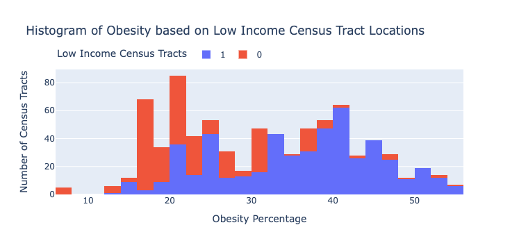
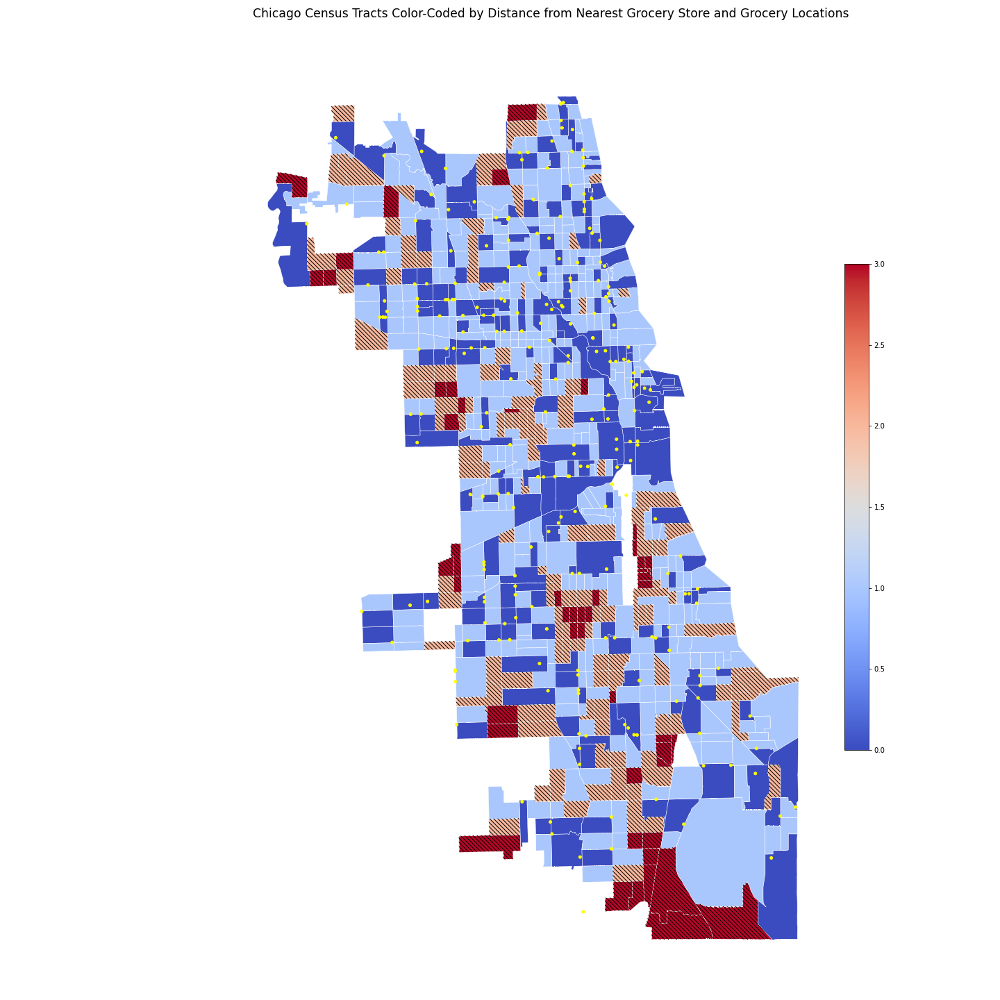
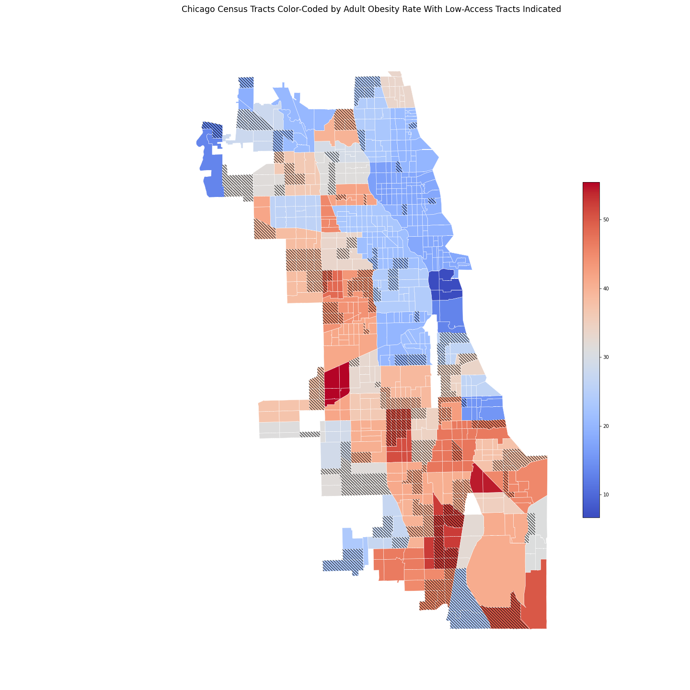

-Downtown Chicago

#  Food Deserts In Chicago
___
### Alonzo Mays, Kathy Simon, and Mark Harris
___
# Table of Contents
| Topic | Description | Link |
| --- | --- | --- |
| Preliminary EDA | EDA that was performed in a Geopandas Environment |[eda_in_geopandas.ipynb](./eda_in_geopandas.ipynb) |
| Merge Food and Health Data |Merge Food and Health Data and Perform a Preliminary Clean | [food_health_clean_merge.ipynb](./food_health_clean_merge.ipynb) |
| Health Outcome Prediction | Predict Health Outcomes Using Low Access| [health_outcome_prediction.ipynb](./health_outcome_prediction.ipynb) |
| Food Desert Prediction | Predict Food Desert Using Health Outcomes | [predict_food_desert.ipynb](./predict_food_desert.ipynb)
| Demographic Visuals | Visuals created in Plotly About the Demographics | [create_visuals.ipynb](./create_visuals.ipynb) |
| Geographical Visuals | Geographical Visuals created in Geopandas| [create_visuals_geopandas.ipynb](./create_visuals_geopandas.ipynb)|
| Data | Folder Containing Data Files| [data](./data/) |
|Visuals | Folder Containing Visuals| [visuals](./visuals/)|

## Outline
___
### I. Problem Statement
### II. Description of Data
### III. Modeling
### IV. Conclusion/Recommendation
___

### I. Problem Statement

37 million people, including 11 million children, lacked consistent access to healthy food In 2018. That translates to 1 in 9 people having food insecurities in the United States. With so many people experiencing food insecurities, why is approximately $161 million of food wasted?

One reason that so many people in the United States experience food insecurities is that access to healthy food is scarce. There are communities, called food deserts, that have limited access to healthy foods. Our goal is to provide access to healthy foods within these deserts by means of local markets or mobile food trucks.  We will identify food deserts in Chicago using a binary classification model. Once we have identified the food deserts, we will identify optimal locations to provide these neighborhoods with access to healthy foods.

___
### II. Description of Data
[List of grocery store locations in Chicago with latitudes and longitudes](https://data.cityofchicago.org/Community-Economic-Development/Business-Licenses-Current-Active/uupf-x98q/data)

<a href = "https://www.census.gov/geographies/mapping-files/time-series/geo/tiger-line-file.2010.html">Shapefiles containing goegraphy of census tracts</a>

<a href = "https://www.ers.usda.gov/data-products/food-access-research-atlas/download-the-data/">Food access data from U.S. Department of Agriculture</a>

<a href= "http://robparal.blogspot.com/2015/03/equivalency-file-for-using-complete.html?q=chicago+community+areas">Data used to match Chicago census tracts to community areas</a>

The data used in this project consisted of food access, health, and grocery store locations.  The food access data was from the U.S. Department of Agriculture.  Information on several factors associated with food deserts was included in this data on the level of census tracts.  The health data was from Chicago Health Atlas and was provided on the level of community area.  The grocery store locations in latitude and longitude were from the Chicago Open Data portal.  Additionally, shapefiles containing the boundaries of individual census tracts were used to display the data in GeoPandas, and a separate data set was used to match community areas to the census tracts within them.

-This bar graph shows 1/3 of children ages 17 and younger have access to healthy foods, and about 1/3 of adults aged 65 and older have access to healthy foods. 

 -This histogram shows hows obesity percentage in Chicago affects low income residents.

[link to data dictionary for original low access data](./data/food_data_dictionary.csv)

####  Description of Important Features
| Feature | Type | Dataset | Description |
| --- | --- | --- | --- |
| LowIncomeTracts | int | [food_obesity.csv](./data/food_obesity.csv) | Flag for low income tract |
| HUNVFlag | int | [food_obesity.csv](./data/food_obesity.csv)| Flag for tract where >= 100 of households do not have a vehicle, and beyond 1/2 mile from supermarket |
| LATracts1 | int | [food_obesity.csv](./data/food_obesity.csv)| Flag for low access tract when considering 1 mile distance |
| LATracts_half | int |[food_obesity.csv](./data/food_obesity.csv) | Flag for low access tract when considering 1/2 mile distance |
| TractSNAP_percent | float |  [food_obesity.csv](./data/food_obesity.csv)| Percentage of housing units receiving SNAP benefits in tract |
| HCSOBP_2016-2018 | float |[food_obesity.csv](./data/food_obesity.csv) | Percentage of obesity in tract |
| HCSDIAP_2016-2018 | float |[food_diabetes.csv](./data/food_diabetes.csv)  | Percentage of diabetes in tract

___
### III. Modeling
To identify the food access features most relevant to health disparities, we fit linear regression models to predict obesity and diabetes rates.  We first dropped all food access features with Null values so we would not need to exclude any census tracts.  We also excluded demographic data from this process.  We did not think that demographic information should be part of the food desert definition.  We used the remaining features to predict both obesity and diabetes rates.  We found  that our linear regression was able to perform better than baseline in predicting obesity and diabetes based on food access features.  We also found that poverty rate and food access within a half mile consistently performed as strong indicators in the regressions. 

--The color coding on this map shows the distance from each census tract to the nearest grocery store. The yellow points indicate grocery store locations. The numerical distance scale on the right is based on latitude and longitude, making it difficult to give an exact conversion to miles. However, based on the information here, we can say that dark blue tracts have a store in them, light blue have a store within about 1/3 mile, light red have a store within about 2/3 mile, and dark red have no store within about 2/3 mile.  The cross hatching shows areas of concern based on distance from the nearest store.

--This map shows the obesity rates in each community area overlaying the census tract grid. The shaded census tracts show the areas of concern regarding low access to healthy food. Many of the areas of concern also have high obesity rates. 

Based on this analysis, we designed a logistic regression model to predict whether a census tract had low food access based on income, vehicle access, SNAP participation, obesity rate, and diabetes rate.  We found that our model performed better than baseline at predicting low food access, with an accuracy of about 85%, precision of 83%, and recall of 65%.  This shows that such methods could be used to identify potential food deserts in need of intervention based on existing health, income, vehicle, and SNAP data.

___
### IV. Conclusion/Recommendation
Problems in Chicago's food deserts are multilayered, with no quick fix. We looked at Chicago's obesity and diabetes rates
and mapped out the the Census Tract areas. From there we identified the highest problem areas throughout the Chicago region. We recommend the following 3 actions:

<ol><li> Investigate other factors in the modeling process 
   <ol> a.) Cardiovascular Disease  
    b.) Education outcomes 
    c.) Access to healthcare
   </ol> 
<li> Take a behavioral approach to understanding residents in Chicago food deserts 
<ol>a.) See if time  is an issue for residents, making it difficult to fix healthy meals each day? 
b.) See if economic status has an influence on buying habits 
c.) How can we encourage residents in chicago food deserts to change
    these habits of when more healthy foods become available?</ol>
<li> Chicago should continue to invest in and support small businesses like <a href="https://urbangrowerscollective.org/freshmoves/" target="_blank">The Fresh Food Mobile Market</a>.
 <ol>a.) Encourages residents to learn about growing and cooking different foods  
 b.) They serve affordable ‘healthy foods’ and travel to areas such as schools, churches and clinics to provide easy access 
 c.) Local farms are being built outside of Chicago

    

