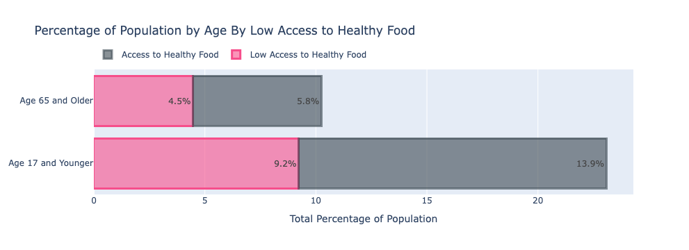

-downtown Chicago

#  Food Deserts In Chicago
___
### Alonzo Mays, Kathy Simon, and Mark Harris
___
# Outline
___
### I. Problem Statement
### II. EDA
### III. Data Dictionary
### IV. Summary
___

### I. Problem Statement

37 million people, including 11 million children, lacked consistent access to healthy food In 2018. That translates to 1 in 9 people having food insecurities in the United States. With so many people experiencing food insecurities, why is approximately $161 million of food wasted?

One reason that so many people in the United States experience food insecurities is that access to healthy food is scarce. There are communities, called food deserts, that have limited access to healthy foods. Our goal is to provide access to healthy foods within these deserts by means of local markets or mobile food trucks.  We will identify food deserts in Chicago using a binary classification model. Once we have identified the food deserts, we will identify optimal locations to provide these neighborhoods with access to healthy foods.
___
### II. EDA
 

___
### III. Data Dictionary
___
### IV. Summary

